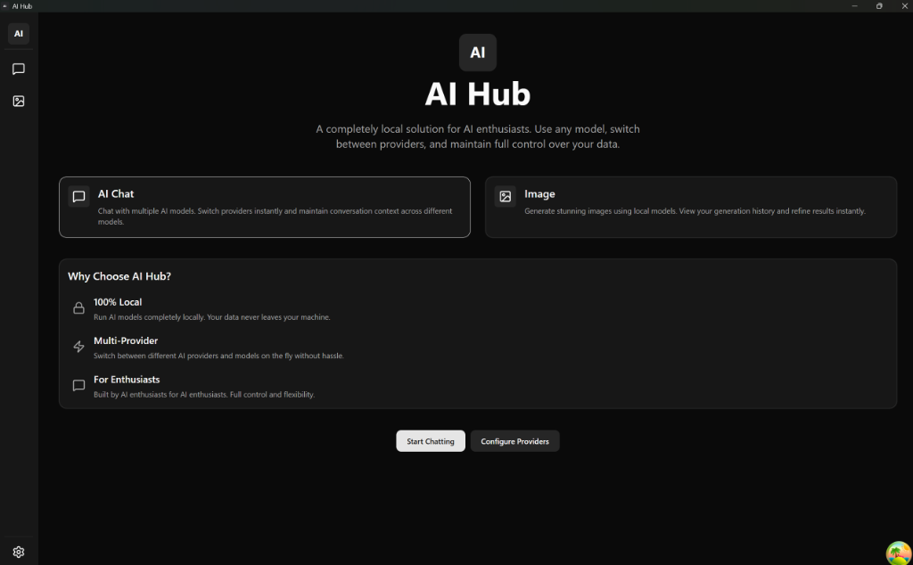
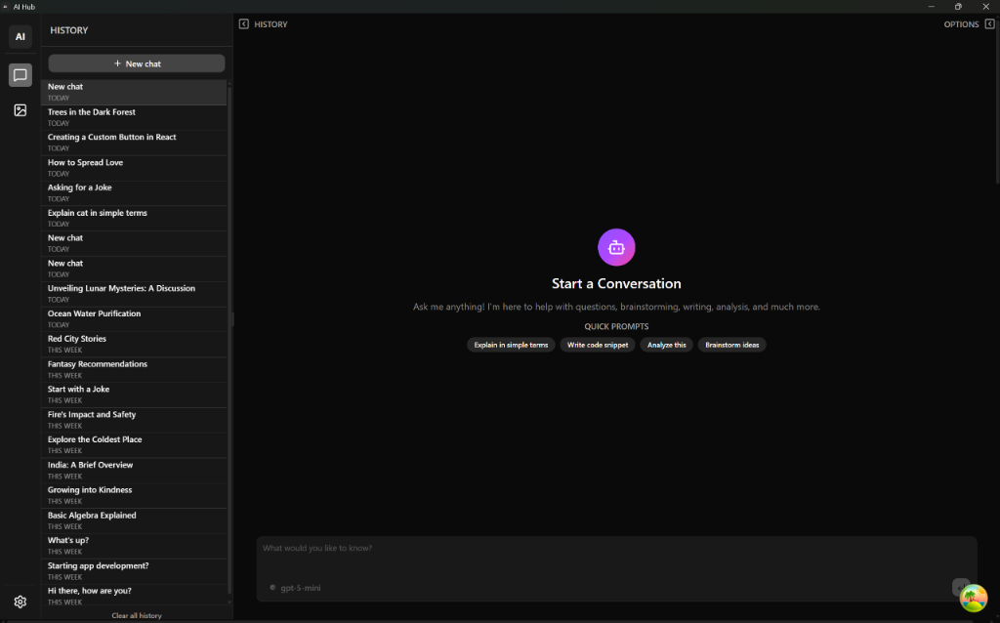
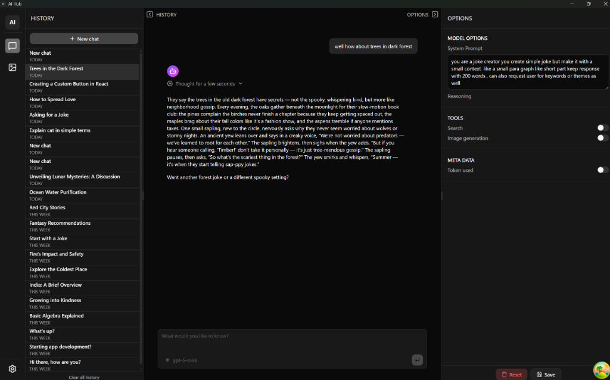
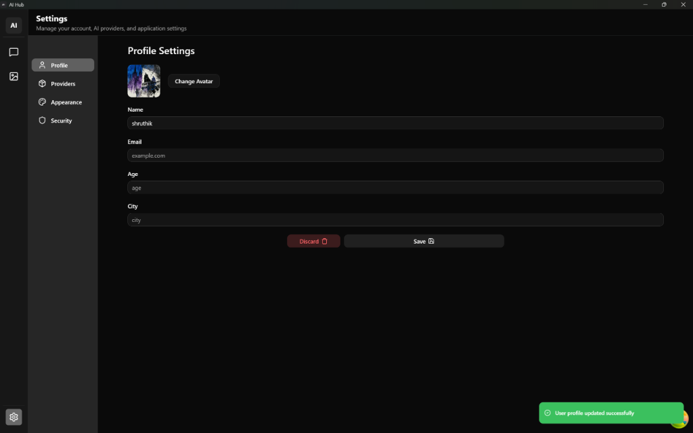
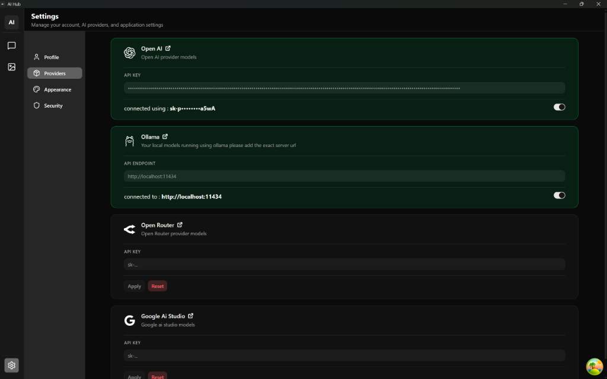
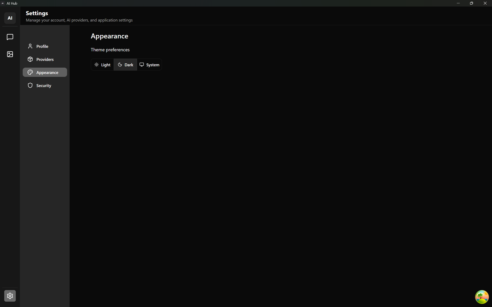

# AI Hub

AI Hub is your personal AI aggregator built on the **Bring Your Own Key (BYOK)** philosophy. You can run AI models of your choice from any available cloud provider (like OpenAI, Anthropic, etc.), or run local models completely offline using tools like [Ollama](https://ollama.com/).

## 🛠️ Tech Stack

- **Runtime**: [Electron](https://www.electronjs.org/), [Node.js](https://nodejs.org/)
- **Frontend**: [React](https://react.dev/) (v19), [Vite](https://vitejs.dev/), [Tailwind CSS](https://tailwindcss.com/) (v4), [Framer Motion](https://motion.dev/), [Zustand](https://zustand-demo.pmnd.rs/)
- **UI & Styling**: [Radix UI](https://www.radix-ui.com/), [shadcn/ui](https://ui.shadcn.com/), [Lucide React](https://lucide.dev/)
- **Backend/Logic**: [Hono](https://hono.dev/)
- **Data Fetching**: [TanStack React Query](https://tanstack.com/query/latest)
- **Database**: [Drizzle ORM](https://orm.drizzle.team/), [LibSQL](https://github.com/tursodatabase/libsql)
- **Validation**: [Zod](https://zod.dev/)
- **AI Integration**: [Vercel AI SDK](https://sdk.vercel.ai/)
- **Testing**: [Vitest](https://vitest.dev/)

## 📦 Project Structure

```text
├── electron.vite.config.ts  # Vite configuration for Electron
├── drizzle.config.ts        # Drizzle ORM configuration
├── electron-builder.yml     # Electron Builder configuration
├── src/
│   ├── common/              # Shared logic, shared Zod schemas, types, and constants
│   ├── main/                # Main process code (Electron & Hono backend)
│   │   ├── config/          # Application configurations
│   │   ├── db/              # Database connections, schemas, and migrations
│   │   ├── middlewares/     # Hono middlewares
│   │   ├── routes/          # API routes for providers, models, settings, etc.
│   │   ├── worker.ts        # Worker process entry point
│   │   └── index.ts         # Main process entry point
│   ├── preload/             # Electron preload scripts
│   └── renderer/            # Renderer process code (React App frontend)
│       └── src/             # Frontend source
│           ├── components/  # Reusable UI components
│           ├── hooks/       # Custom React hooks
│           ├── pages/       # React application pages/routes
│           ├── store/       # Zustand state management
│           └── main.tsx     # React application entry point
└── out/                     # Build output directory (generated)
```

## ⚡ Getting Started

### Prerequisites

- Node.js (v20 LTS or higher recommended)
- npm (or bun/yarn/pnpm)

### Installation

Clone the repository and install dependencies:

```bash
git clone <your-repo-url>
cd ai-hub
npm install
```

### Development

Start the app in development mode with hot-reload:

```bash
npm run dev
```

### Database Management

Commands for managing your local SQLite database with Drizzle:

- **Generate Migrations**:
  ```bash
  npm run drizzle:generate
  ```
- **Open Drizzle Studio** (Visual database editor):
  ```bash
  npm run drizzle:studio
  ```
- **Push Changes** (Prototyping):
  Push schema changes directly to the database without generating migrations.
  ```bash
  npm run drizzle:push
  ```

### Testing

Run the test suite using Vitest:

```bash
npm run test
```

### Linting & Formatting

- **Lint Code**:
  ```bash
  npm run lint
  ```
- **Format Code**:
  ```bash
  npm run format
  ```

## 🏗️ Building for Production

Compile and package the application for your operating system:

### Windows

```bash
npm run build:win
```

### macOS

```bash
npm run build:mac
```

### Linux

```bash
npm run build:linux
```

The packaged application will be available in the `dist/` directory.

## 📝 Configuration

- **Environment Variables**: Manage `.env` files for sensitive configs.
- **Electron Builder**: Modify `electron-builder.yml` to change app metadata, icons, and build settings.

## ✨ App Showcase

### Dashboard

The central hub for all AI-powered modules.


### Chat Interface

Intuitive conversational experience with multi-model support.


Modify the model options.


### Personal Profile

Manage your identity and app-wide preferences.


### AI Providers

Securely manage and switch between various AI service providers.


### Themes

switch between light and dark themes.

