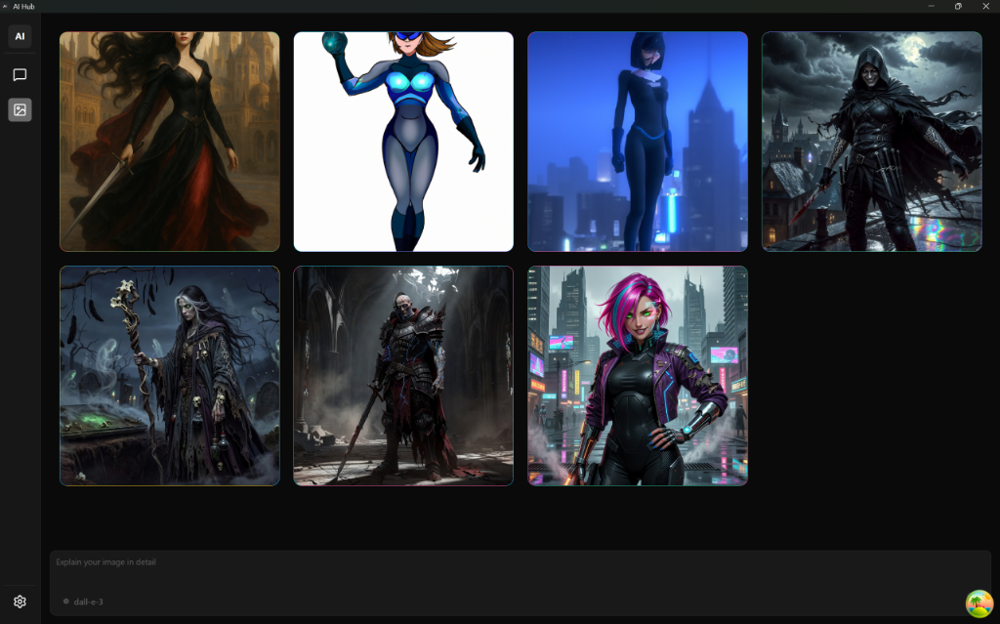
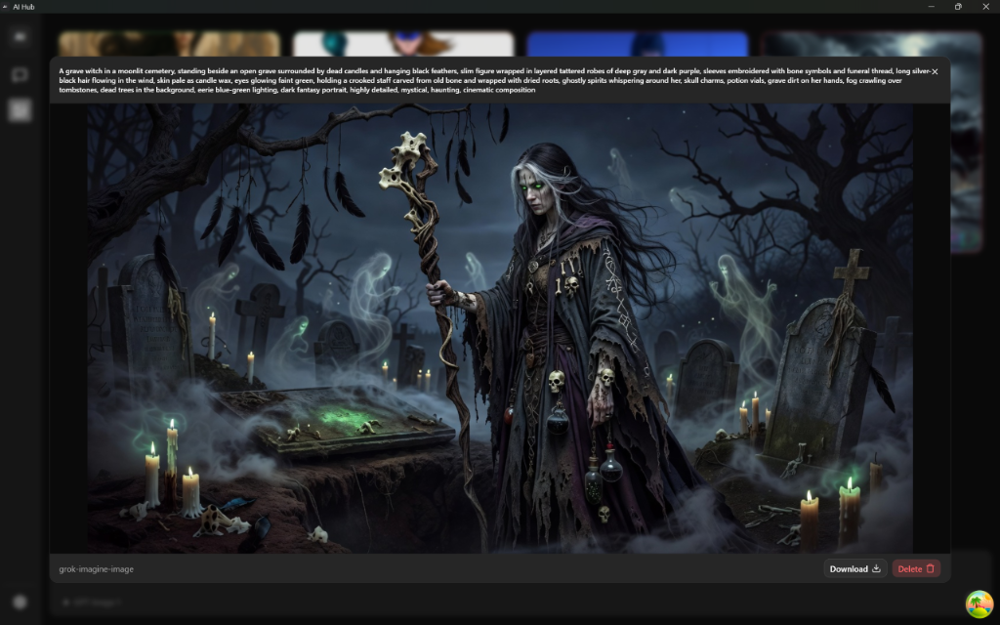

# AI Hub

AI Hub is your personal AI aggregator built on the **Bring Your Own Key (BYOK)** philosophy. You can run AI models of your choice from any available cloud provider (like OpenAI, Anthropic, etc.), or run local models completely offline using tools like [Ollama](https://ollama.com/).

## 🚀 Key Features

- **Local App, Your Keys**: AI Hub runs entirely on your machine — no servers, no telemetry. However, when using cloud providers, your prompts and responses are processed by those providers and may be subject to their data retention policies. For full privacy, use local providers like Ollama or LM Studio.
- **Multi-Provider Support**: Seamlessly switch between 11+ AI providers — cloud or local.
- **Advanced AI Chat**: Modular chat interface with multi-model support, conversation history, and context persistence.
- **Built-in AI Tools**: Extend model capabilities with tools available within the chat:
  - 🔍 **Web Search** — Ground model responses with real-time search results (supported on OpenAI, xAI, Groq [only `openai/gpt-oss-20b`, `openai/gpt-oss-120b`], Google).
  - 👤 **User Profile Access** — Models can access your personal profile for more personalized responses.
  - 🖼️ **Image Generation** — Generate images directly from the chat interface using supported models.
- **Image Generation & Gallery**: Dedicated view for generating images with a full gallery, detailed metadata, and download/delete support.
- **Reasoning Support**: Native support for reasoning/thinking models (e.g., GPT-5, Grok).
- **Secure Key Management**: API keys are encrypted at rest using AES encryption.
- **Modern UI/UX**: Stunning interface with Light, Dark, and System theme support.

## 📥 Download

Get the latest version of AI Hub for your operating system:

| Platform | Download |
| :--- | :--- |
| **Windows** | [Download .exe](https://github.com/shruthikshetty/ai-hub/releases/latest) |
| **macOS** | [Download .dmg](https://github.com/shruthikshetty/ai-hub/releases/latest) |

> [!TIP]
> After downloading, just run the installer and you're ready to go! No complex setup required.

## 🔌 Supported Providers

AI Hub supports a wide range of cloud and local providers:

- **Cloud Providers**: OpenAI, Google AI Studio, Open Router, Groq, xAI, Together AI, Fireworks AI, Vercel AI Gateway, Hugging Face.
- **Local Providers**: Ollama, LM Studio.

## 🛠️ Tech Stack

- **Runtime**: [Electron](https://www.electronjs.org/), [Node.js](https://nodejs.org/)
- **Frontend**: [React](https://react.dev/) (v19), [Vite](https://vitejs.dev/), [Tailwind CSS](https://tailwindcss.com/) (v4), [Zustand](https://zustand-demo.pmnd.rs/)
- **UI & Styling**: [Radix UI](https://www.radix-ui.com/), [shadcn/ui](https://ui.shadcn.com/), [Lucide React](https://lucide.dev/)
- **Backend/Logic**: [Hono](https://hono.dev/)
- **Data Fetching**: [TanStack React Query](https://tanstack.com/query/latest)
- **Database**: [Drizzle ORM](https://orm.drizzle.team/), [LibSQL](https://github.com/tursodatabase/libsql)
- **Validation**: [Zod](https://zod.dev/)
- **AI Integration**: [Vercel AI SDK](https://sdk.vercel.ai/)
- **Testing**: [Vitest](https://vitest.dev/)

## 📦 Project Structure

```text
├── electron.vite.config.ts  # Vite configuration for Electron
├── drizzle.config.ts        # Drizzle ORM configuration
├── electron-builder.yml     # Electron Builder configuration
├── src/
│   ├── common/              # Shared logic, shared Zod schemas, types, and constants
│   ├── main/                # Main process code (Electron & Hono backend)
│   │   ├── config/          # Application configurations
│   │   ├── db/              # Database connections, schemas, and migrations
│   │   ├── middlewares/     # Hono middlewares
│   │   ├── routes/          # API routes for providers, models, settings, etc.
│   │   ├── worker.ts        # Worker process entry point
│   │   └── index.ts         # Main process entry point
│   ├── preload/             # Electron preload scripts
│   └── renderer/            # Renderer process code (React App frontend)
│       └── src/             # Frontend source
│           ├── components/  # Reusable UI components
│           ├── hooks/       # Custom React hooks
│           ├── pages/       # React application pages/routes
│           ├── store/       # Zustand state management
│           └── main.tsx     # React application entry point
└── out/                     # Build output directory (generated)
```

## ⚡ Getting Started

### Prerequisites

- Node.js (v20 LTS or higher recommended)
- npm (or bun/yarn/pnpm)

### Installation

Clone the repository and install dependencies:

```bash
git clone <your-repo-url>
cd ai-hub
npm install
```

### Development

Start the app in development mode with hot-reload:

```bash
npm run dev
```

### Database Management

Commands for managing your local SQLite database with Drizzle:

- **Generate Migrations**:
  ```bash
  npm run drizzle:generate
  ```
- **Open Drizzle Studio** (Visual database editor):
  ```bash
  npm run drizzle:studio
  ```
- **Push Changes** (Prototyping):
  Push schema changes directly to the database without generating migrations.
  ```bash
  npm run drizzle:push
  ```

### Testing

Run the test suite using Vitest:

```bash
npm run test
```

### Linting & Formatting

- **Lint Code**:
  ```bash
  npm run lint
  ```
- **Format Code**:
  ```bash
  npm run format
  ```

## 🏗️ Building for Production

Compile and package the application for your operating system:

### Windows

```bash
npm run build:win
```

### macOS

```bash
npm run build:mac
```

### Linux

```bash
npm run build:linux
```

The packaged application will be available in the `dist/` directory.

## 📝 Configuration

- **Environment Variables**: Manage `.env` files for sensitive configs.
- **Electron Builder**: Modify `electron-builder.yml` to change app metadata, icons, and build settings.

## ✨ App Showcase

### Dashboard

The central hub for all AI-powered modules.


### Chat Interface

Intuitive conversational experience with multi-model support and integrated tool capabilities.


### Image Generation & Details

Create stunning visuals with built-in image generation capabilities using available image models.


View detailed metadata and actions for each generated image.


### Personal Profile

Manage your identity and app-wide preferences.


### AI Providers

Securely manage and switch between various AI service providers.


### Themes

Switch between light and dark themes.

